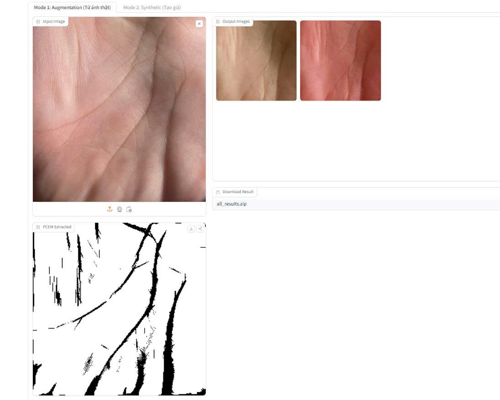

# Diff-Palm: Synthetic Palmprint Generation using Diffusion Models

## 📌 Overview

This project implements a synthetic palmprint image generation system
based on Diff-Palm, a diffusion-based model for biometric image
synthesis.

The model is inspired by the research paper:
https://arxiv.org/abs/2503.18312

The system generates realistic palmprint images to support data
augmentation, biometric research, and privacy-preserving applications.

The model is deployed as an interactive web application:
https://huggingface.co/spaces/loinguyen5704/diff-palm-app

---

## ✨ Key Highlights

- Diffusion-based generative model (Diff-Palm)
- High-quality synthetic palmprint generation
- End-to-end ML pipeline
- Hugging Face deployment
- Suitable for biometric applications

---

## ✨ Application Features

### 🔹 Feature 1: Palmprint Augmentation from Input Image

- Input: 1 palmprint image

- Output: Multiple synthetic variations

- Preserve main palm lines

- Simulate different environmental conditions

---

### 🔹 Feature 2: Synthetic Dataset Generation by Identity

- Input:
  - Number of IDs
  - Images per ID
- Output:
  - Structured synthetic dataset

---

## 🧠 Model & Methodology

### Base Paper

Diff-Palm (Diffusion-based Palmprint Generation)

### Approach

1.  Data preprocessing
2.  Diffusion model training
3.  Image generation
4.  Visualization

---

## 🏗️ System Architecture

User → Web UI → Inference → Diffusion Model → Output Image

---

## 🌐 Live Demo

https://huggingface.co/spaces/loinguyen5704/diff-palm-app

<p align="center">
  
</p>
---

## 📁 Project Structure

```
├── app.py # Entry point for application (UI / inference)
├── Diff-Palm.zip # Source or pretrained model package
├── packages.txt # System-level dependencies (for Hugging Face Spaces)
├── README.md # Project documentation
├── requirements.txt # Python dependencies
├── run_diff_palm.sh # Script to run the application
│
├── models/
│└── model.pt # Trained Diff-Palm model weights
│
└── utils/
    └── pcem.py # Utility functions (processing / enhancement)
```

---

## ⚙️ Tech Stack

- Python
- PyTorch
- Diffusion Models
- OpenCV
- Hugging Face Spaces

---

## 🚀 Getting Started

### Install

```
pip install -r requirements.txt
```

### Run

```
python app/app.py
```

---

## 📈 Future Improvements

- Add evaluation metrics (FID, SSIM)
- Improve inference speed
- Conditional generation

---

## 💼 Value

- Diffusion model implementation
- Research-to-product pipeline
- Real-world deployment

---

## 👨‍💻 Authors

- Nguyen Tran Loi
- Nguyen Nhat Long
- Tran Minh Tam

---

## 📜 License

MIT

---

## 🔗 References

https://arxiv.org/abs/2503.18312

https://huggingface.co/spaces/loinguyen5704/diff-palm-app
